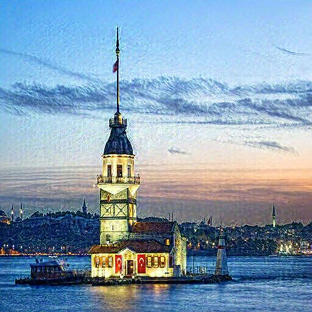
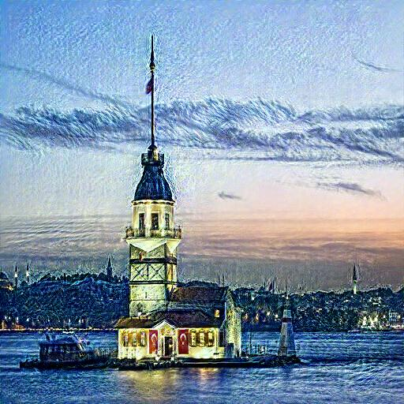
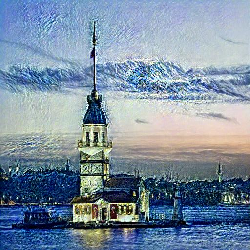
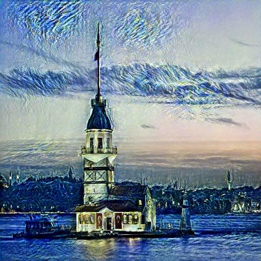

# 🎨 Classical Neural Style Transfer (NST)

Implementation of the **original Gatys et al. (2015)** neural style transfer algorithm in PyTorch.

Includes experiments with **multiple β (style loss) weights** and several distinct **artistic styles** such as Japanese watercolor, mythological art, Van Gogh, and Pop Art.

## ✨ Features

- 🧠 **VGG19-based feature extraction:** Pre-trained model for content and style representation
- 🎯 **Multi-beta experiments:** Analyze style intensity across different weights
- ⚡ **LBFGS optimizer:** Smooth convergence for high-quality results
- 🎨 **Multiple artistic styles:** 4 distinct style categories with 3 images each
- 📊 **Visual comparisons:** Loss curves and grid layouts for analysis
- 🔧 **Modular design:** Clean, easy-to-extend codebase

> 💡 This project uses the classic optimization-based approach, which directly optimizes pixels rather than using fast feed-forward networks.

---

## 📦 Table of Contents

- [Project Structure](#-project-structure)
- [Overview](#-overview)
- [Example Results](#️-example-results)
- [Styles Used](#-styles-used)
- [Installation & Usage](#️-installation--usage)
  - [Install Dependencies](#1️⃣-install-dependencies)
  - [Run the Notebook](#2️⃣-run-the-notebook)
  - [Change Images](#3️⃣-change-images-optional)
- [Multi-Beta Experiment](#️-multi-beta-experiment)
- [References](#-references)
- [License](#-license)

---

## 📁 Project Structure

```
NST/
│
├── classical_nst/
│   ├── classical_nst.ipynb           # Main NST implementation
│   └── multi_beta_experiment.ipynb   # Experiment: multiple β values comparison
│
├── results/
│   └── multi_beta_loss/              # Outputs and visual comparisons
│       ├── output_beta1e+03.jpg
│       ├── output_beta1e+04.jpg
│       ├── output_beta1e+05.jpg
│       ├── output_beta5e+04.jpg
│       ├── loss_comparison.jpg
│       ├── comparison_grid.jpg
│       └── output.jpg
│
├── style/                            # Style reference images
│   ├── japanese/
│   ├── mythlogical/
│   ├── vangogh/
│   └── popart/
│
├── foto.jpg                          # Example content image
└── .gitignore
```

---

## 🧩 Overview

This project performs **neural style transfer** by combining the *content* of one image with the *style* of another.

Unlike fast NST methods, this is the **classic optimization-based approach**, which directly optimizes the pixels of the target image.

### How It Works

1. **Content Representation:** Extract content features from a content image using VGG19
2. **Style Representation:** Extract style features (Gram matrices) from a style image
3. **Optimization:** Minimize combined content and style loss using LBFGS
4. **Output:** Generate a new image that preserves content structure with artistic style

---

## 🖼️ Example Results

### 🔹 Multi-β Style Comparison

| β=1e+03 | β=1e+04 | β=5e+04 | β=1e+05 |
|:--:|:--:|:--:|:--:|
|  |  |  |  |

📈 **See also:**
- [`loss_comparison.jpg`](results/multi_beta_loss/loss_comparison.jpg) — Loss curves across different β values
- [`comparison_grid.jpg`](results/multi_beta_loss/comparison_grid.jpg) — Side-by-side comparison grid

---

## 🧠 Styles Used

- 🎋 **Japanese Watercolor** — Traditional Japanese art with soft gradients
- 🏛️ **Mythological Art** — Classical mythological paintings
- 🌻 **Van Gogh Paintings** — Post-impressionist brushwork
- 💥 **Pop Art** — Bold colors and graphic elements

Each style category contains 3–5 representative images in `/style/`.

---

## ⚙️ Installation & Usage

### 1️⃣ Install Dependencies

```bash
pip install torch torchvision Pillow matplotlib
```

**Required libraries:**
- PyTorch (1.8+)
- torchvision
- Pillow
- matplotlib
- numpy

### 2️⃣ Run the Notebook

Open `classical_nst/classical_nst.ipynb` in Jupyter or VSCode Notebook mode.

```bash
jupyter notebook classical_nst/classical_nst.ipynb
```

**Workflow:**
1. Load content and style images
2. Extract features using VGG19
3. Run optimization loop
4. Save and visualize results

### 3️⃣ Change Images (Optional)

Replace the following files with your own images:

- **Content image:** `foto.jpg` → your content image
- **Style image:** `/style/<style_name>/image.jpg` → your style image

**Supported formats:** JPG, PNG, JPEG

---

## ⚖️ Multi-Beta Experiment

`multi_beta_experiment.ipynb` explores how changing the style weight **β** affects the output.

### Parameters

| Parameter | Description | Typical Range |
|-----------|-------------|---------------|
| **α (content weight)** | Preserves structure and content | 1 |
| **β (style weight)** | Controls texture & color strength | 1e3 – 1e5 |
| **Steps** | Number of optimization iterations | 300–500 |

### Interpretation

- 🧩 **Lower β** → More content preservation, less stylization
- 🎨 **Higher β** → Stronger style texture, more artistic

### Running the Experiment

```bash
jupyter notebook classical_nst/multi_beta_experiment.ipynb
```

The notebook will generate:
- Multiple outputs with different β values
- Loss comparison plots
- Grid comparison of results

---

## 📚 References

- **Original Paper:** [Gatys et al., 2015 — A Neural Algorithm of Artistic Style](https://arxiv.org/abs/1508.06576)
- **PyTorch Tutorial:** [Neural Transfer Using PyTorch](https://pytorch.org/tutorials/advanced/neural_style_tutorial.html)
- **VGG19 Architecture:** [Simonyan & Zisserman, 2014](https://arxiv.org/abs/1409.1556)

---

## 🪪 License

Released under the **MIT License**.

Feel free to use, modify, and share.

```
MIT License © 2025
```

---

## 🧠 Author's Note

**Classical Neural Style Transfer** implements the foundational algorithm that started the artistic style transfer revolution in computer vision.

This project demonstrates deep learning concepts including feature extraction, loss optimization, and artistic style synthesis.

---

<div align="center">

**⭐ Star this project if you found it useful!**

</div>
